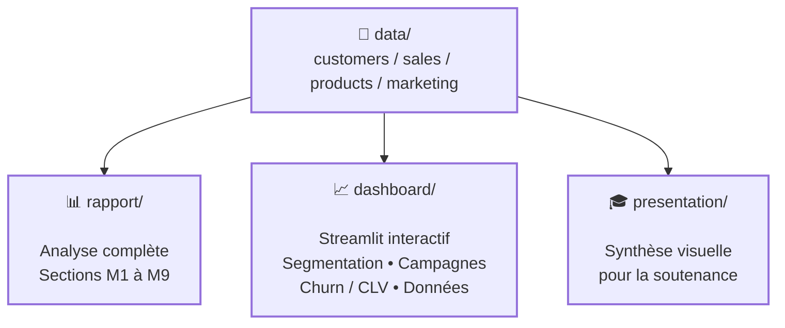

# 📊 Analyse & Optimisation Marketing — Segmentation Client

Projet pédagogique — École Nationale d'Informatique (ENI), Université de Fianarantsoa
Mention Intelligence Artificielle.

Exploitation de données clients, produits, ventes et campagnes pour segmenter la clientèle, analyser les comportements d'achat, évaluer les performances marketing et proposer une stratégie digitale personnalisée assistée par l'IA.

Ce dépôt est le dépôt global du projet : il réunit le rapport, la présentation et le dashboard interactif.

---

## 🎯 Objectif du projet

Une entreprise dispose souvent de données clients, ventes et campagnes dispersées, sans vision d'ensemble exploitable pour orienter ses décisions marketing. Ce projet répond à ce besoin en couvrant toute la chaîne, de l'analyse brute à la recommandation stratégique :

- segmenter la clientèle pour identifier des profils d'achat distincts ;
- mesurer la performance des campagnes marketing par canal ;
- estimer le risque de perte de clients (churn) et leur valeur potentielle (CLV) ;
- en tirer une stratégie digitale personnalisée ;
- rendre l'ensemble explorable via un dashboard interactif.

---

## 📌 Problématique

Comment exploiter les données clients, produits, ventes et campagnes pour segmenter la clientèle, évaluer l'efficacité marketing, anticiper le churn, et en déduire une stratégie digitale personnalisée — tout en assumant les limites d'un échantillon pédagogique volontairement restreint ?

---

## 🏗️ Architecture du projet



Le dossier `data/` est la source unique de vérité : le rapport, le dashboard et la présentation s'appuient tous sur les mêmes 4 fichiers CSV.

---

## 📁 Structure du dépôt

```text
.
├── rapport/
│   └── Rapport_Analyse_Optimisation_Marketing.pdf
├── presentation/
│   └── Presentation_Analyse_Optimisation_Marketing.pptx
├── dashboard/
│   ├── app.py                  # application Streamlit
│   ├── churn_clv.py            # pipeline churn / CLV (module M6)
│   ├── churn_clv_results.csv   # sortie du pipeline (générée)
│   ├── churn_clv_summary.json  # sortie du pipeline (générée)
│   └── requirements.txt
└── data/
    ├── customers_data.csv
    ├── sales_data.csv
    ├── products_data.csv
    └── marketing_data.csv
```

---

## 🚀 Installation et lancement du dashboard

```bash
git clone https://github.com/Ranto-nyaina/Analyse_Optimisation_Marketing
cd Analyse_Optimisation_Marketing/dashboard
pip install -r requirements.txt
python churn_clv.py        # régénère les résultats churn/CLV si data/ a changé
streamlit run app.py
```

> ⚠️ https://github.com/Ranto-nyaina/Analyse_Optimisation_Marketing et Analyse_Optimisation_Marketing sont des placeholders — à remplacer par l'URL et le nom réels avant publication.

Le rapport (`rapport/`) et la présentation (`presentation/`) sont des fichiers statiques (`.docx`, `.pdf`, `.pptx`) : aucune installation n'est nécessaire pour les consulter, il suffit de les ouvrir.

---

## 🔄 Modules couverts (cf. cahier des charges pédagogique)

| Module | Contenu | Où le trouver |
|---|---|---|
| M1 | Enjeux stratégiques | rapport, section 1 |
| M2 | Exploration des données | rapport, section 2-3 ; dashboard, onglet Données |
| M3-M4 | Segmentation & profils | rapport, section 4 ; dashboard, onglet Segmentation |
| M5 | Performance campagnes | rapport, section 5 ; dashboard, onglet Campagnes |
| M6 | Churn / CLV | rapport, section 6 ; dashboard, onglet Churn & CLV |
| M7 | Stratégie digitale | rapport, section 7 |
| M8 | Dashboard interactif | dossier `dashboard/` |
| M9 | Présentation finale | `presentation/`, rapport section 9 |

Cette table sert aussi de sommaire pour un correcteur : chaque module attendu par le cahier des charges est traçable jusqu'à sa preuve concrète (section de rapport ou onglet du dashboard).

---

## ⚠️ Avertissement méthodologique

L'échantillon fourni est volontairement restreint :

- 5 clients
- 5 ventes
- 5 produits
- 5 campagnes

Conséquence directe : les résultats de segmentation et du modèle churn/CLV sont illustratifs, pas statistiquement significatifs. Ils démontrent une démarche méthodologique complète, pas une prédiction fiable en conditions réelles.

Le churn, en particulier, est mesuré par un proxy (absence de vente enregistrée) faute de vraie variable de résiliation dans les données disponibles — un choix qui peut confondre churn réel et simple pause d'achat.

Voir le rapport (sections 4 et 6) et le dashboard pour le détail des limites.

---

## 🚀 Perspectives d'amélioration

### Données

- remplacer l'échantillon pédagogique par un volume représentatif avant toute exploitation opérationnelle ;
- collecter une vraie variable de résiliation pour fiabiliser le modèle de churn.

### Modélisation

- valider les clusters de segmentation avec un score de qualité (silhouette score) ;
- comparer plusieurs algorithmes de segmentation, pas seulement K-means ;
- documenter les métriques de performance du modèle churn/CLV (précision, rappel).

### Déploiement

- héberger le dashboard en ligne plutôt qu'en local uniquement ;
- automatiser la régénération des résultats churn/CLV (actuellement manuelle via `python churn_clv.py`).

---

## 📚 Compétences mises en œuvre

- Analyse de données marketing
- Segmentation client
- Modélisation exploratoire (churn, CLV)
- Stratégie digitale assistée par l'IA
- Dashboard interactif (Streamlit)
- Rédaction de rapport et présentation de synthèse
- Git / GitHub

---

## 👨‍🎓 Contexte académique

- **Établissement :** École Nationale d'Informatique (ENI), Université de Fianarantsoa
- **Mention :** Intelligence Artificielle
- **Projet :** Analyse & Optimisation Marketing — Segmentation Client

---

## 📌 Conclusion

Ce dépôt réunit une chaîne complète Données → Segmentation → Campagnes → Churn/CLV → Stratégie → Dashboard → Présentation, couvrant l'intégralité des modules M1 à M9 du cahier des charges.

Sa valeur pédagogique ne repose pas sur la fiabilité statistique des modèles — délibérément limitée par un échantillon de 5 clients — mais sur la démonstration d'une démarche méthodologique de bout en bout, avec une transparence assumée sur ses limites plutôt qu'une présentation de résultats surinterprétés.

---

## 📄 Licence / usage

Projet académique — ENI Fianarantsoa. Usage pédagogique uniquement.
